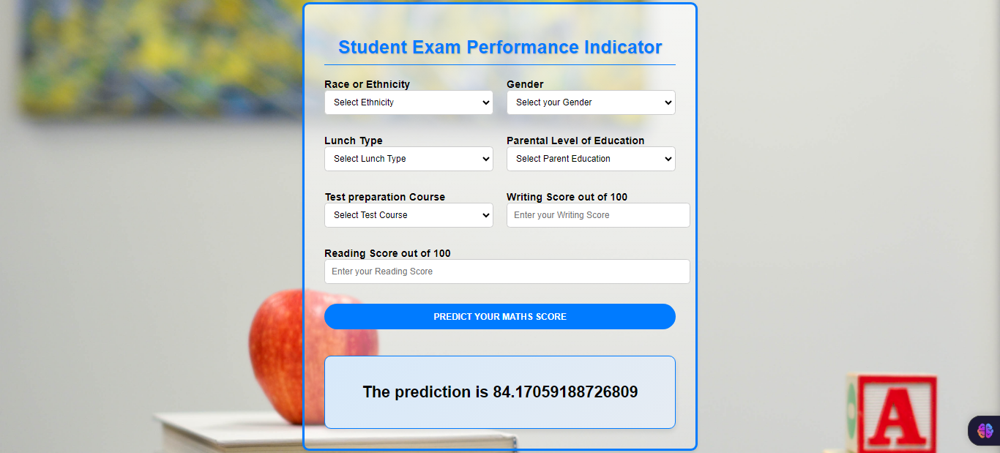

# Student Performance Indicator - Zabih ullah

**Problem Statement** 
- This project understands how the student's performance (`test Score`) is affected by other variables such as Gender, Ethnicity, Parental level of education, Lunch and Test preparation course.

#### Life cycle of Machine Learning Project

- Understanding the Problem Statement
- Data Collection
- Data Checks to perform
- Exploratory data analysis
- Data Pre-Processing
- Model Training
- Choose the best model

### Data 
- The data consists of 8 columns and 1000 rows.

Target variable:
* `math score`: The math score of the student is the Target variable.

# Screenshot of UI

# Approach for the project 

1. Data Ingestion : 
    * In the Data Ingestion phase the data is first read as CSV. 
    * Then the data is split into training and testing and saved as csv file.

2. Data Transformation : 
    * In this phase a ColumnTransformer Pipeline is created.
    * for Numeric Variables first SimpleImputer is applied with strategy median , then Standard Scaling is performed on numeric data.
    * for Categorical Variables SimpleImputer is applied with most frequent strategy, then ordinal encoding performed , after this data is scaled with Standard Scaler.
    * This preprocessor is saved as pickle file.

3. Model Training : 
    * In this phase base model is tested . The best model found was Linear Regression.
    * After this hyperparameter tuning is performed on catboost and knn model etc.
    * A final VotingRegressor is created which will combine prediction of catboost, xgboost and , Decision Tree and Linear Regression.
    * This model is saved as pickle file.

4. Prediction Pipeline : 
    * This pipeline converts given data into dataframe and has various functions to load pickle files and predict the final results in python.

5. Flask App creation : 
    * Flask app is created with User Interface to predict the students marks inside a Web Application.

